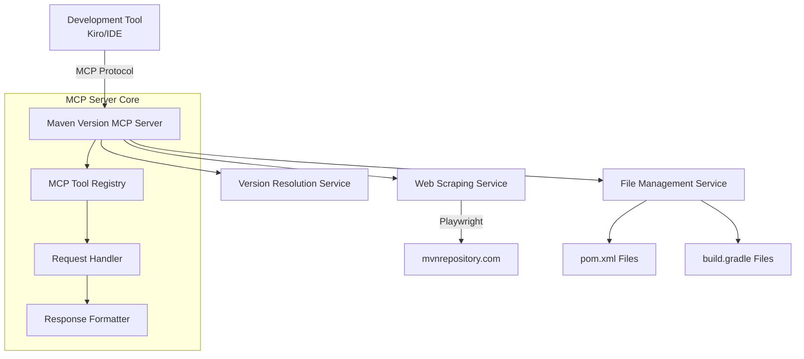
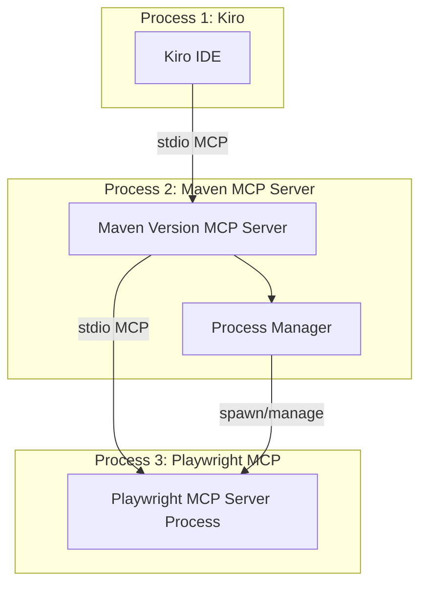

# Design Document

## Overview

The Maven Version MCP Server is a Kotlin-based Model Context Protocol server that provides dependency version management capabilities for Java projects. The server leverages the Kotlin MCP SDK from the Model Context Protocol organization and uses Playwright for reliable web scraping of mvnrepository.com. The system exposes MCP tools that enable development environments like Kiro to search for dependencies, retrieve version information, and automatically update project build files.

## Architecture

### High-Level Architecture



> **✅ Architecture Note**: The implementation now uses proper stdio-based MCP protocol communication with subprocess management for the Playwright MCP server, which is the standard way MCP servers communicate in production. This was completed in task 6.5.

### Technology Stack

- **Language**: Kotlin (JVM)
- **MCP Framework**: Kotlin MCP SDK from modelcontextprotocol/kotlin-sdk
- **Web Automation**: Playwright for Kotlin
- **Build Tool**: Gradle with Kotlin DSL
- **HTTP Client**: Ktor client for additional HTTP requests if needed
- **JSON Processing**: Kotlinx.serialization
- **File Processing**: Built-in Kotlin file I/O with XML/Gradle parsing libraries

### MCP Communication Architecture

The Maven Version MCP Server operates in a dual role:

1. **As an MCP Server**: Receives requests from Kiro via stdio-based MCP protocol
2. **As an MCP Client**: Communicates with Playwright MCP server for web automation

**Current Implementation**:
- Stdio-based MCP protocol communication
- Subprocess management for Playwright MCP server
- Proper MCP handshake and capability negotiation
- Process lifecycle management (start, stop, restart on failure)
- Health checks and automatic recovery



## Components and Interfaces

### 1. MCP Server Core

**MCPServer**
- Implements the main MCP server using the Kotlin MCP SDK
- Registers available tools and handles MCP protocol communication
- Manages server lifecycle and connection handling

**ToolRegistry**
- Registers and manages available MCP tools
- Provides tool schemas and metadata
- Routes tool calls to appropriate handlers

### 2. Web Scraping Service

**MavenRepositoryClient**
- Manages Playwright browser automation
- Implements web scraping logic for mvnrepository.com
- Handles rate limiting and retry logic
- Parses HTML responses to extract dependency information

**SearchResultParser**
- Parses search results from mvnrepository.com
- Extracts artifact information (groupId, artifactId, description)
- Handles different page layouts and structures

**VersionParser**
- Parses version information from dependency pages
- Extracts version numbers, release dates, and metadata
- Handles version sorting and filtering

### 3. File Management Service

**ProjectFileDetector**
- Detects project type (Maven vs Gradle)
- Locates build files (pom.xml, build.gradle, build.gradle.kts)
- Validates file accessibility and permissions

**MavenFileManager**
- Reads and parses pom.xml files
- Updates dependency versions in Maven projects
- Preserves XML formatting and structure
- Validates XML syntax before and after modifications

**GradleFileManager**
- Reads and parses Gradle build files (Groovy and Kotlin DSL)
- Updates dependency versions in Gradle projects
- Handles different dependency declaration formats
- Preserves file formatting and structure

### 4. Version Resolution Service

**DependencyResolver**
- Resolves dependency coordinates (groupId:artifactId)
- Handles version comparison and sorting
- Provides latest version resolution logic

**VersionComparator**
- Implements semantic version comparison
- Handles different versioning schemes (semantic, date-based, etc.)
- Provides version filtering capabilities

### 5. MCP Tools

**SearchDependencyTool**
- Tool name: `search_dependency`
- Parameters: `query` (string)
- Returns: List of matching dependencies with metadata

**GetLatestVersionTool**
- Tool name: `get_latest_version`
- Parameters: `groupId` (string), `artifactId` (string)
- Returns: Latest version information

**GetAllVersionsTool**
- Tool name: `get_all_versions`
- Parameters: `groupId` (string), `artifactId` (string), `limit` (optional int)
- Returns: List of all available versions

**UpdateMavenDependencyTool**
- Tool name: `update_maven_dependency`
- Parameters: `groupId` (string), `artifactId` (string), `version` (optional string), `filePath` (optional string)
- Returns: Update status and modified file information

**UpdateGradleDependencyTool**
- Tool name: `update_gradle_dependency`
- Parameters: `groupId` (string), `artifactId` (string), `version` (optional string), `filePath` (optional string)
- Returns: Update status and modified file information

## Data Models

### Dependency
```kotlin
@Serializable
data class Dependency(
    val groupId: String,
    val artifactId: String,
    val description: String?,
    val url: String?
)
```

### Version
```kotlin
@Serializable
data class Version(
    val version: String,
    val releaseDate: String?,
    val isLatest: Boolean = false,
    val downloads: Long? = null,
    val vulnerabilities: Int? = null
)
```

### UpdateResult
```kotlin
@Serializable
data class UpdateResult(
    val success: Boolean,
    val message: String,
    val filePath: String,
    val oldVersion: String?,
    val newVersion: String?,
    val wasAdded: Boolean = false
)
```

### SearchResult
```kotlin
@Serializable
data class SearchResult(
    val dependencies: List<Dependency>,
    val totalResults: Int,
    val query: String
)
```

## Error Handling

### Web Scraping Errors
- **Network Failures**: Implement exponential backoff retry logic with maximum retry attempts
- **Parsing Failures**: Return structured error messages when HTML parsing fails
- **Rate Limiting**: Implement request throttling and respect website rate limits
- **Browser Automation Failures**: Clean up browser resources and provide fallback mechanisms

### File Operation Errors
- **File Not Found**: Provide clear error messages when build files cannot be located
- **Permission Errors**: Handle file permission issues gracefully
- **Malformed Files**: Validate file syntax before attempting modifications
- **Backup and Recovery**: Create backup copies before modifying files

### MCP Protocol Errors
- **Invalid Parameters**: Validate tool parameters and return appropriate error responses
- **Tool Execution Failures**: Wrap exceptions in MCP error format
- **Connection Issues**: Handle client disconnections and reconnections

### Validation Errors
- **Invalid Coordinates**: Validate Maven coordinates format (groupId:artifactId)
- **Version Format**: Validate version string formats
- **File Format**: Validate XML and Gradle file syntax

## Testing Strategy

### Unit Testing
- **Service Layer Tests**: Test each service component in isolation
- **Parser Tests**: Test HTML parsing logic with mock HTML responses
- **File Manager Tests**: Test file operations with temporary test files
- **Version Comparison Tests**: Test version sorting and comparison logic

### Integration Testing
- **MCP Protocol Tests**: Test MCP tool registration and execution
- **Web Scraping Tests**: Test against live mvnrepository.com (with rate limiting)
- **File System Tests**: Test file operations in controlled environments
- **End-to-End Tests**: Test complete workflows from MCP call to result

### Mock Testing
- **Playwright Mocking**: Mock browser automation for consistent testing
- **File System Mocking**: Mock file operations for isolated testing
- **Network Mocking**: Mock HTTP responses for reliable testing

### Performance Testing
- **Concurrent Request Handling**: Test server performance under load
- **Memory Usage**: Monitor memory consumption during web scraping
- **Response Time**: Measure tool execution times and optimize bottlenecks

### Error Scenario Testing
- **Network Failures**: Test behavior when mvnrepository.com is unavailable
- **Malformed Responses**: Test parsing with corrupted HTML responses
- **File System Errors**: Test handling of file permission and access issues
- **Invalid Input**: Test tool behavior with malformed parameters